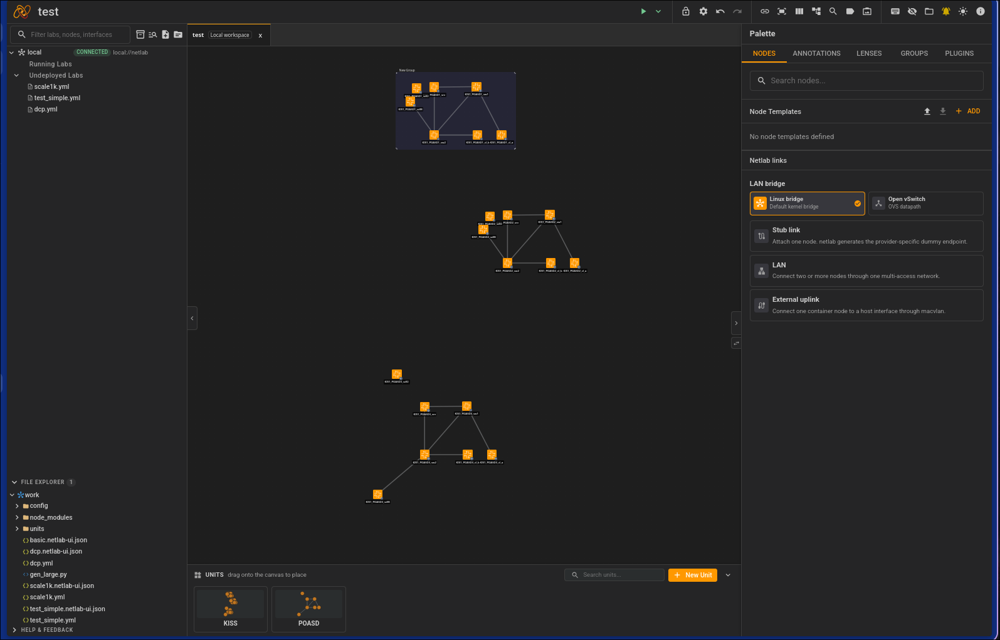
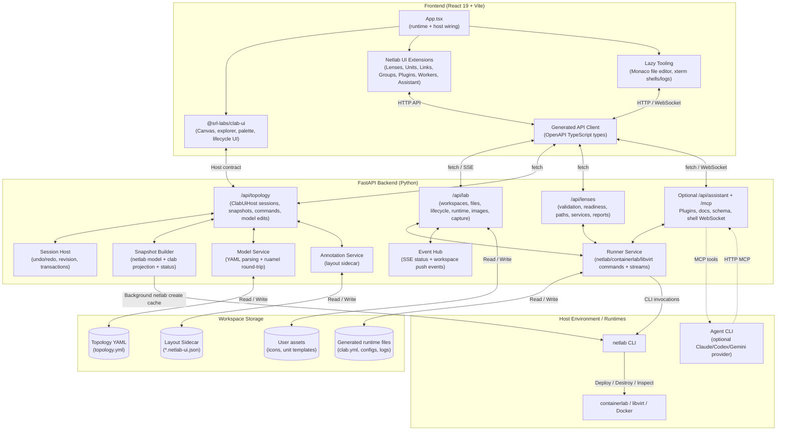
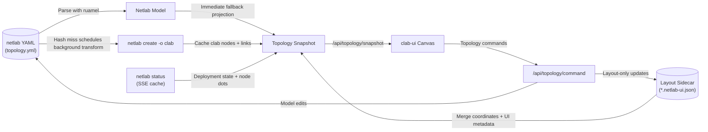
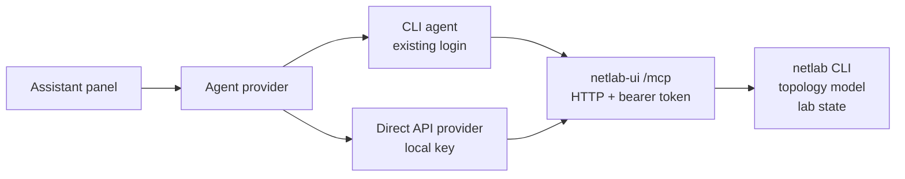

<p align="center">
  
</p>

---

> [!WARNING]
> **Beta testing phase:** netlab-ui is under active development. Features and APIs may change, and you may encounter bugs. Please use it in test environments and report any issues you find.

> _"I always start stuff although I tell myself I don't have time for it... and yet, here we are."_

Welcome to **netlab-ui**! This project is a refurbished, tailormade topology viewer and editor for [**netlab**](https://github.com/ipspace/netlab) (ipspace/netlab).

Ideally, this would have been a generic plugin system built directly into [**Containerlab**](https://github.com/srl-labs/containerlab-app)'s topology viewer. But as both have their own kinda of ways to do things instead of over-engineering a perfect plugin architecture, we built this: a dedicated version of [**clab-ui**](https://github.com/srl-labs/clab-ui) adjusted for the netlab ecosystem.

It lets you visualize, author, and inspect netlab topologies, then manage their lifecycles (`netlab up`, status, shell)

<p align="center">
  
</p>

---

## Why this approach?

We consume `@srl-labs/clab-ui` as a normal **npm dependency** (not a fork or local checkout) and feed it netlab data through a thin Python adapter.

- **No Rebasing Debt:** Because `clab-ui` moves fast and is published as a reusable library with an integrator contract, we get design updates via simple version bumps.
- **Single Source of Truth:** Netlab remains the ultimate source of truth. The netlab-to-clab projection (`netlab create -o clab`) is what gets rendered.

---

## Architecture



- **Backend (`backend/`)** — Built with FastAPI. It implements clab-ui's `ClabUiHost` contract (`/api/topology/{sessions,snapshot,command}`), wraps lab lifecycle/runtime/file APIs, and provides lenses, plugin, schema/docs, shell, capture, and optional assistant surfaces.
- **Frontend (`frontend/`)** — React 19 + Vite. Consumes the clab-ui canvas and overlays netlab-native panels and tools for units, links, groups, plugins, workers, lenses, files, shells/logs, and the optional assistant.

### Data & Projection Flow

To keep the primary netlab YAML file clean, coordinates and visual metadata are projected/merged on-the-fly and stored in a sidecar file.



---

## Quick Start

### 🐍 Venv + NPM (the normal path)

**1. Spin up the backend:**

```bash
cd backend
python3 -m venv .venv && . .venv/bin/activate
pip install -e ".[dev]"
# pip install -e ".[netlab]"           # if you don't already have netlab + ansible installed locally
# pip install -e ".[assistant]"
pytest                                   # Run the tests
uvicorn app.main:app --reload --reload-exclude 'tests/*' --timeout-graceful-shutdown 2
```

The backend package and application images do not bundle netlab or Ansible.
Use **Settings → Environment** to select an existing `netlab` executable, or
set `NETLAB_BIN=/path/to/netlab`. A pipx or separate virtualenv installation is
supported: the backend uses that executable's Python environment for `netsim`
metadata and prepends its `bin/` directory when netlab launches child tools.
For a containerized UI, mount the selected netlab environment into the
container at the same path.

**2. Spin up the frontend:**

```bash
cd frontend
npm install                              # See "Installing @srl-labs/clab-ui" below for the required token
npm run dev                              # Frontend runs at http://localhost:5173
```

### ❄️ Nix (Flake) — if that's your thing

Nobody's making you use Nix, but if you already do, the included `flake.nix` gives you a dev shell with Python 3.12, Node 24, and the `networklab` package.

```bash
nix run            # Starts backend (:8000) + frontend (:5173). Ctrl-C stops both!
```

> [!NOTE]
> The first run will automatically execute `npm install` for the frontend.

#### Other Flake entrypoints:

```bash
nix run .#backend  # Start only the backend
nix run .#frontend # Start only the frontend
nix run .#test     # Run pytest suites

nix develop        # Drop into the dev shell (or run `direnv allow`)
```

---

## Installing `@srl-labs/clab-ui`

`@srl-labs/clab-ui` lives on **GitHub Packages** and requires **Node ≥ 24**:

1. Create a GitHub personal access token (PAT) with `read:packages` permissions.
2. Create `frontend/.npmrc` (copy `frontend/.npmrc.sample`) pointing `@srl-labs:registry` at `https://npm.pkg.github.com`, and set `export NODE_AUTH_TOKEN=your_token_here`.
3. Install dependencies as usual:
   ```bash
   cd frontend
   npm install
   ```

The frontend imports `@srl-labs/clab-ui` directly wherever it's needed (see `frontend/src/App.tsx`, `frontend/src/host/`, etc.) — there is no local checkout, stub, or swap-point to configure.

> **Note:** `@srl-labs/clab-ui` is currently pinned to an exact version (`0.3.0`)
> with a `patch-package` patch applied on install (`frontend/patches/`) to
> restore exports an upstream cleanup accidentally dropped. This is temporary —
> see `frontend/AGENTS.md` for details and the removal plan once upstream
> republishes a fixed version.

---

## API Types (generated, single source of truth)

Response shapes are defined **once** in Python and the frontend's TypeScript
types are **generated** from them.

- **Source of truth:** every API response is a Pydantic model in
  [`backend/app/contract/responses.py`](backend/app/contract/responses.py),
  attached to its endpoint via `response_model=`. This makes FastAPI's
  `/openapi.json` schema complete.
- **Generated types:** [`frontend/src/api/generated.ts`](frontend/src/api/generated.ts)
  is produced from that schema with [`openapi-typescript`]. **Do not edit it by
  hand.**
- **Consumer:** [`frontend/src/api/client.ts`](frontend/src/api/client.ts) imports
  those generated types (`Schemas["CommandResult"]`, etc.) instead of hand-rolling
  response interfaces.

### Regenerating after a backend change

```bash
# 1. Backend must be running so its OpenAPI schema is reachable:
cd backend && uvicorn app.main:app --reload --reload-exclude 'tests/*' --timeout-graceful-shutdown 2

# 2. In another shell, regenerate the TS types and type-check:
cd frontend
npm run gen:api          # reads http://localhost:8000/openapi.json -> src/api/generated.ts
npm run typecheck        # tsc --noEmit; fails if a consumer is out of sync
```

Point at a non-default backend with `OPENAPI_URL`:

```bash
OPENAPI_URL=http://my-host:9000/openapi.json npm run gen:api
```

**Workflow:** change a response shape → add/adjust the model in `responses.py` →
`npm run gen:api` → `tsc` flags any frontend code that no longer matches. A
mismatched Pydantic field and TS interface now fails at compile time instead of
at runtime.

[`openapi-typescript`]: https://github.com/openapi-ts/openapi-typescript

---

## 🤖 AI Assistant (experimental, optional)

> [!WARNING]
> **This is a trial feature.** It ships switched on where its dependencies are installed and off everywhere else, so it can be evaluated in real use — and removed again without ceremony if it turns out not to earn its place. Everything it touches lives in `backend/services/assistant/`, `backend/app/assistant/` and `frontend/src/panels/assistant/`, plus three small hooks (a guarded import in `backend/app/main.py`, one tab push in `frontend/src/App.tsx`, a few wrappers in `frontend/src/api/client.ts`). Deleting those three directories and reverting those three hooks removes the feature entirely.

An **Assistant** tab that can read your topology, inspect the running lab, and propose changes you approve as a diff. Pick the provider, model and agent **mode** (Ask / Plan / Build / Tutor) from the composer; type `/` for slash commands (`/model`, `/provider`, `/new`, `/history`); toggle the whole panel with **Ctrl+I**. Conversations are kept per lab, survive a page refresh, and can be reopened or deleted from the history list.

### Two ways to connect

Whichever you use, netlab-ui exposes its capabilities as an **MCP server** and the agent reaches back into the lab through it:



- **CLI agents — your existing login, no key handled by netlab-ui.** It drives an agent CLI you've already installed and signed in (a Claude Pro/Max plan just works). **Claude Code** and **Codex** are supported.
- **Direct-API providers — your key, stored on this machine only.** **Gemini**, **ChatGPT (OpenAI)**, and any **OpenAI-compatible endpoint** (Ollama, LM Studio, vLLM, OpenRouter…). Set the key from the panel's provider settings or via an environment variable; choose the model from the composer.

The panel shows each provider's status (which CLIs it found, which keys are set), so an unavailable provider is diagnosable from the UI rather than a silent failure.

### What it can do

|             |                                                                                                                                                                                          |
| ----------- | ---------------------------------------------------------------------------------------------------------------------------------------------------------------------------------------- |
| **Explain** | Reads the source YAML _and_ the transformed model, so it can answer "what IP did r1 get" — which the file alone can't.                                                                   |
| **Author**  | Proposes edits as a unified diff. Nothing is written until you click Apply, and what lands goes through the same undoable command path as a canvas edit — so `Ctrl-Z` works.             |
| **Analyse** | Runs read-only commands on running nodes (`show …`, `ping`, `traceroute`) and interprets the output. Writes and configuration are rejected mechanically, not by asking the model nicely. |
| **Teach**   | Tutor mode explains rather than does, and can propose a link impairment for you to apply so you have something real to debug.                                                            |

The **mode** picked in the composer shapes each turn: **Ask** (investigate, no changes), **Plan** (research and lay out an ordered plan), **Build** (propose the smallest complete edit, still approval-gated), **Tutor** (guide you rather than do it for you).

### Enabling it

The dependencies are an optional extra, so a normal install doesn't pull them in. When they're absent the tab simply never appears — nothing else changes.

```bash
cd backend
pip install -e ".[assistant]"        # adds mcp, claude-agent-sdk, google-genai, openai
```

Then connect at least one provider and restart the backend; the **Assistant** tab appears next to Workers:

- **A CLI agent** — install it and log in once (e.g. [Claude Code](https://claude.com/claude-code), then run `claude` and sign in; or Codex). It's picked up from `PATH`.
- **A direct-API provider** — set a key from the panel's provider settings (⚙), or export one before starting the backend: `NETLAB_APP_GEMINI_API_KEY`, `NETLAB_APP_OPENAI_API_KEY`, or `NETLAB_APP_OPENAI_COMPAT_BASE_URL` (+ `…_API_KEY`) for a local/OpenAI-compatible endpoint.

It lives in the right-hand panel, but a conversation outlives that panel — you'll want Nodes or Lenses back while the agent works. The ⧉ button moves it into its own window (`?popout=assistant&sessionId=…`), the same pattern the node shells use.

If the backend extra is installed but no CLI is found, the tab appears and tells you which ones it looked for — that case is diagnosable from the UI. If the extra itself is missing there is no tab at all, which is why the install command lives here.

Switch it off explicitly with `NETLAB_APP_ASSISTANT=off`, regardless of what's installed:

| Variable                       | Default                     | Meaning                                                                                         |
| ------------------------------ | --------------------------- | ----------------------------------------------------------------------------------------------- |
| `NETLAB_APP_ASSISTANT`         | `auto`                      | `auto` = on when the extra is installed; `on` = also warn when it isn't; `off` = fully disabled |
| `NETLAB_APP_ASSISTANT_TOKEN`   | random per start            | Bearer token for `/mcp`; set it to keep the value stable across restarts                        |
| `NETLAB_APP_ASSISTANT_MCP_URL` | `http://127.0.0.1:8000/mcp` | Override when the backend is behind a proxy or on another port                                  |
| `NETLAB_APP_ASSISTANT_FAKE`    | unset                       | Adds a scripted "Demo" provider — exercises the whole panel with no CLI and no tokens           |
| `NETLAB_APP_GEMINI_API_KEY` / `…_MODEL`         | unset  | Gemini key (and optional default model). An env-set value locks the field in the UI            |
| `NETLAB_APP_OPENAI_API_KEY` / `…_MODEL`         | unset  | OpenAI (ChatGPT) key and optional default model                                                |
| `NETLAB_APP_OPENAI_COMPAT_BASE_URL` / `…_API_KEY` / `…_MODEL` | unset | Any OpenAI-compatible endpoint — Ollama, LM Studio, vLLM, OpenRouter          |

### Point your own agent at the lab

The same MCP endpoint works for any MCP client, so you can drive a lab from your own terminal agent instead of the panel. `GET /api/assistant/capabilities` returns a ready-to-paste config (URL, token and the tool list):

```bash
curl -s localhost:8000/api/assistant/capabilities | jq -r .mcp.clientConfig
```

### Why edits need approval

Everything the assistant reads — device output, file contents, config comments — is untrusted input to a model. So the trust boundary is drawn in code rather than in the prompt: the MCP tools can only read, `exec_on_node` enforces a read-only allowlist, and the single write path (`propose_topology_edit`) stages a diff that a human has to approve. The worst outcome of a prompt injection is a proposal you look at and reject.

### Ideas parked for later

Written down so they don't get lost, not because they're scheduled:

- **More providers** — Claude Code and Codex (CLI), plus Gemini, OpenAI and any OpenAI-compatible endpoint (API key) all ship today. Still open: adapters for other terminal agents, and richer local-model ergonomics for people who want nothing leaving the host.
- **Deployment troubleshooting** — feed `netlab up` failures and node logs straight into a turn, so "why did this fail" needs no copy-pasting.
- **Comment-preserving structural edits** — today the assistant is steered towards whole-file edits because the structural command path reformats YAML and drops comments (a pre-existing trait of the serializer, shared with canvas edits). Fixing that at the serializer would make every diff smaller.
- **Richer tutor mode** — generated exercise sets, progress tracking, and faults injected at the config level rather than only as link impairments.
- **Topology review** — an on-demand critique of a design (addressing, redundancy, module choices) rather than a chat turn.
- **Multi-lab context** — reasoning across every topology in a workspace, not just the open one.

---

## Running It as One Container

The dev setup above runs the backend and frontend as two separate processes. The root [`Dockerfile`](Dockerfile) instead builds the frontend and bakes the static output straight into the FastAPI backend, so the whole app is one image on one port — same shape as [containerlab-app](https://github.com/srl-labs/containerlab-app)'s web app / desktop split, minus the split: our backend already _is_ the thing their `clab-api-server` is, so there's no separate API service to stand up first.

`@srl-labs/clab-ui` is a private GitHub Packages dependency, so the build needs a token with `read:packages` passed in as a BuildKit secret — never as a build `ARG`, which would leak it into the image layers:

```bash
DOCKER_BUILDKIT=1 docker build --secret id=github_token,env=GITHUB_TOKEN -t netlab-ui .
```

Run it:

```bash
docker run -d --name netlab-ui \
  -p 8000:8000 \
  -v /var/run/docker.sock:/var/run/docker.sock \
  -v $(pwd)/labs:/work \
  -e NETLAB_WORKSPACE=/work \
  netlab-ui
```

Open `http://localhost:8000` — that one port serves both the UI and the API. `netlab` and `containerlab` are already installed inside the image (see the `Dockerfile`); the Docker socket mount is what lets `containerlab` drive lab nodes on the host's Docker daemon. libvirt-based providers aren't included yet.

---

## Desktop App

[`desktop/`](desktop/) is an Electron shell around the same UI — no bundled backend, same as the container above: point it at a running netlab-ui backend (this machine or a remote netlab host) and it renders that backend's UI in a native window. Defaults to `http://localhost:8000`; change it any time from the **Server** menu.

The shell does not build a second copy of the frontend. It displays the frontend served by the selected backend, including the `clab-ui` patch applied by `frontend/patches/` during that frontend's build.

The window that loads the backend's UI gets zero Node/IPC access (`contextIsolation`, `sandbox`, `nodeIntegration: false` — see [`desktop/src/main.js`](desktop/src/main.js)); only the local connect screen gets the settings bridge, and [`desktop/src/preload.js`](desktop/src/preload.js) refuses to expose it to anything not loaded from `file://`. Same reasoning containerlab-app, Jellyfin, and Home Assistant's desktop clients use for "point this app at a server I trust."

```bash
cd desktop
npm install
npm start                # launches against your running backend
npm run check            # lint + unit tests
```

Packaging is via `electron-builder`:

```bash
npm run build:linux   # AppImage + .deb + .rpm
npm run build:mac     # universal .dmg (build on macOS)
npm run build:win     # NSIS .exe
```

Cross-compiling `.dmg` needs a macOS host (Apple's toolchain isn't available on Linux); Windows can be built cross-platform. Nothing is code-signed yet, so macOS Gatekeeper/Windows SmartScreen will warn on the built installers — same unsigned state containerlab-app's desktop releases are in today.

**Releasing:** [`.github/workflows/desktop-release.yml`](.github/workflows/desktop-release.yml) builds all three platforms in parallel (Linux/macOS/Windows runners) and publishes them to a GitHub Release. Push a tag to trigger it:

```bash
git tag desktop-v0.1.0 && git push origin desktop-v0.1.0
```

That prefix (`desktop-v*`, not `v*`) is deliberate — it keeps desktop releases on their own tag namespace, separate from whatever the repo's other `v*` tags are used for.

---

## Thanks

None of this exists without [ipspace/netlab](https://github.com/ipspace/netlab) and [srl-labs/clab-ui](https://github.com/srl-labs/clab-ui) / [srl-labs/containerlab](https://github.com/srl-labs/containerlab) doing the actual hard work underneath. Big thanks to SRL Labs and Nokia for open-sourcing and maintaining tools this good ❤️
