<p align="center">
  
</p>

<p align="center">
  <a href="https://github.com/Muddyblack/netlab-ui/releases/latest"></a>
  <a href="https://github.com/Muddyblack/netlab-ui/releases"></a>
  <a href="https://github.com/Muddyblack/netlab-ui/pkgs/container/netlab-ui"></a>
  <a href="docs/features.md"></a>
  <a href="LICENSE"></a>
</p>

---

> _"I always start stuff although I tell myself I don't have time for it... and yet, here we are."_

**netlab-ui** is a web interface for [**netlab**](https://netlab.tools/) ([ipspace/netlab](https://github.com/ipspace/netlab)). Build and edit network lab topologies visually, work with netlab YAML, and deploy labs from your browser. It supports containerlab containers, libvirt virtual machines, and external devices, with [features depending on the provider](docs/features.md#providers-containerlab-libvirt-vms-external-devices).

Use the visual topology editor to add nodes and links, configure netlab modules, and inspect your lab. Deploy and destroy labs, open device shells, run commands across nodes, and explore live traffic and network reports from the same UI.

The canvas is powered by [**clab-ui**](https://github.com/srl-labs/containerlab-app), with netlab-specific editors and lifecycle actions implemented in this project.

**[Try the UI preview](https://muddyblack.github.io/netlab-ui/)** · **[Quick start](#quick-start)** · **[Features and provider support](docs/features.md)**

<p align="center">
  <a href="https://youtu.be/S67f3rDm6O0">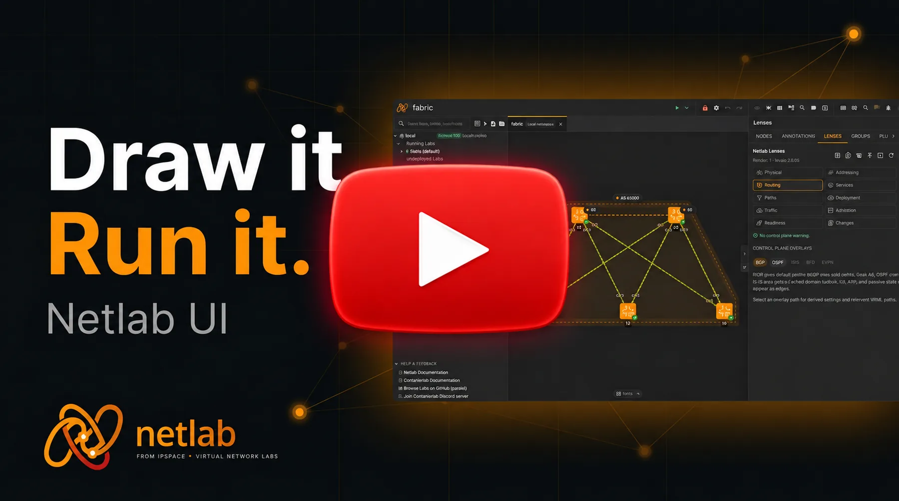</a>
</p>

## In action

<!-- showcase:start -->
<table>
<tr>
<td width="50%" valign="top">
<a href="docs/images/canvas-new-link.webp">
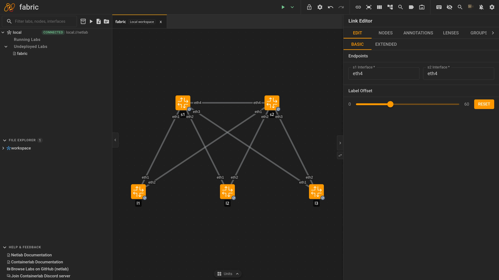
</a>
<p><b>Draw labs on a canvas</b><br />Open a netlab topology as a diagram and edit it there — nodes, links and netlab's own interface names.</p>
</td>
<td width="50%" valign="top">
<a href="docs/images/deploy-progress.webp">
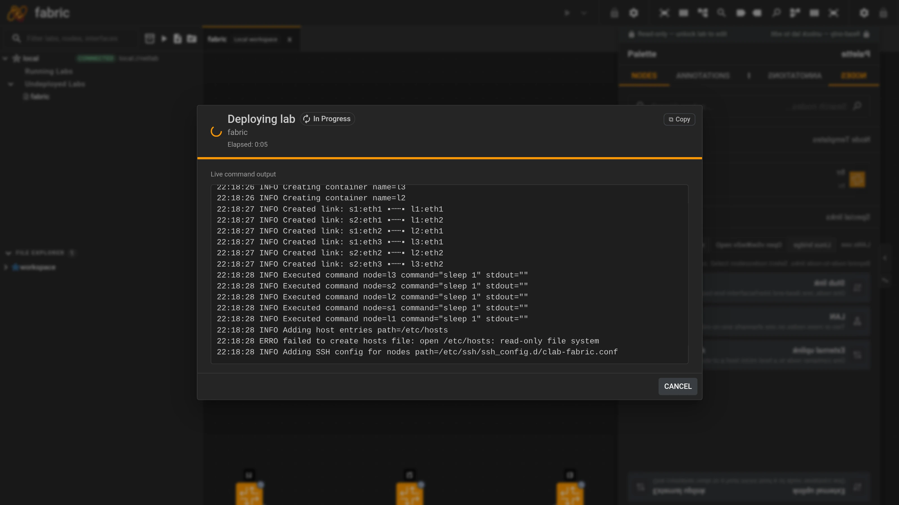
</a>
<p><b>Deploy with live progress</b><br />One click on Deploy, then watch nodes come up as containerlab starts them and Ansible configures them.</p>
</td>
</tr>
<tr>
<td width="50%" valign="top">
<a href="docs/images/running-labs-dialog.webp">
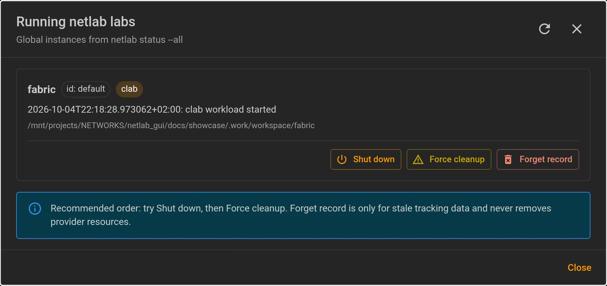
</a>
<p><b>Every running lab, one place to clean up</b><br />See every lab netlab is tracking on the host, then shut one down, force a cleanup, or forget a stale record.</p>
</td>
<td width="50%" valign="top">
<a href="docs/images/command-palette-spotlight.webp">
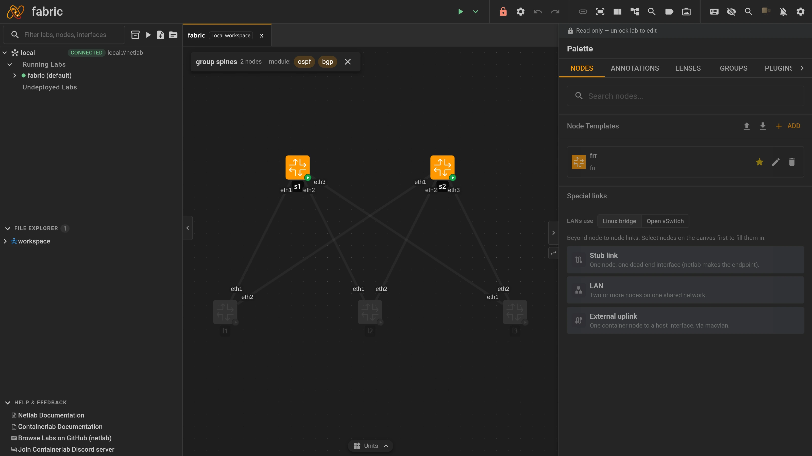
</a>
<p><b>Everything one keystroke away</b><br />Ctrl+P finds labs, nodes, IP addresses, AS numbers and actions — and lights up what it found on the canvas.</p>
</td>
</tr>
<tr>
<td width="50%" valign="top">
<a href="docs/images/node-editor-editor.webp">
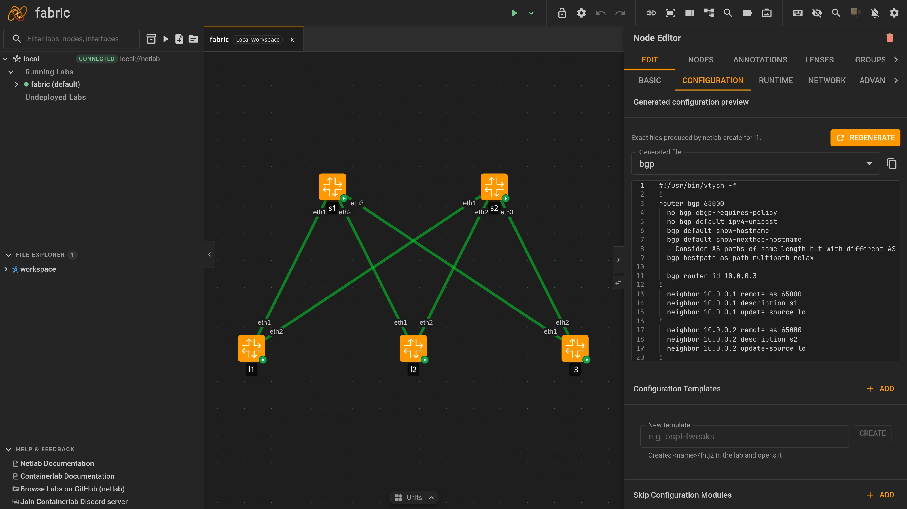
</a>
<p><b>Edit nodes the netlab way</b><br />Device, modules, custom configs and a preview of the exact configuration netlab generates.</p>
</td>
<td width="50%" valign="top">
<a href="docs/images/plugins-details.webp">
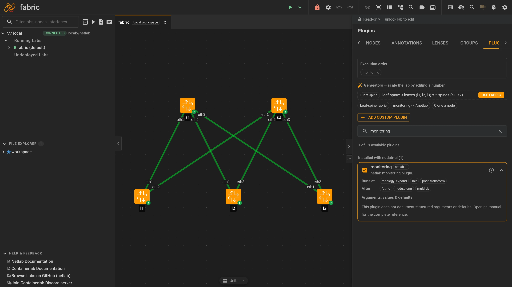
</a>
<p><b>netlab plugins, documented in place</b><br />Browse every netlab plugin, switch them on per lab, see what they hook into, and read the manual behind the info button.</p>
</td>
</tr>
<tr>
<td width="50%" valign="top">
<a href="docs/images/shell-vtysh.webp">
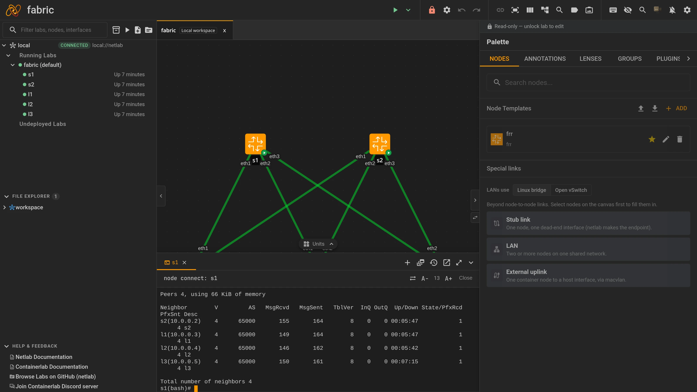
</a>
<p><b>A shell on every node</b><br />Terminals in the browser — the device CLI or Linux shell netlab connect would give you.</p>
</td>
<td width="50%" valign="top">
<a href="docs/images/run-on-nodes-focused.webp">
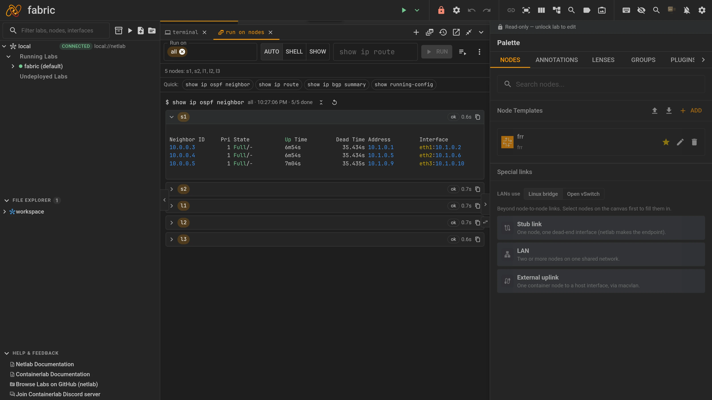
</a>
<p><b>One command, every node</b><br />Send a command to a group of nodes and read every answer, one collapsible section per node. show commands go to each device's CLI.</p>
</td>
</tr>
<tr>
<td width="50%" valign="top">
<a href="docs/images/lenses-routing.webp">
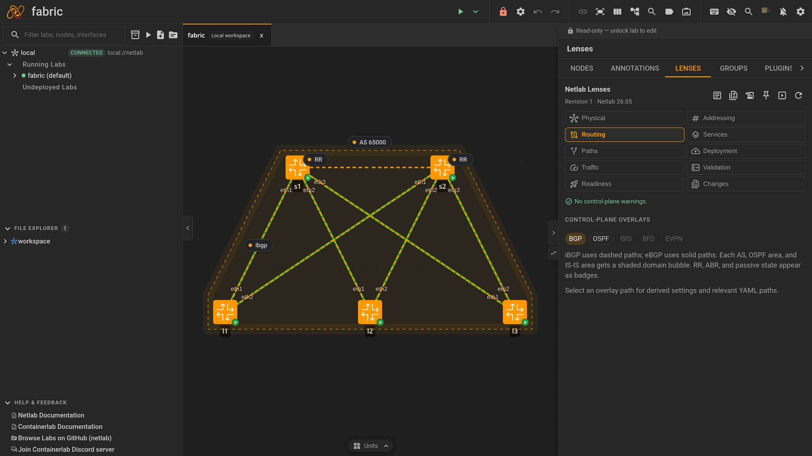
</a>
<p><b>Lenses: one lab, every view</b><br />Physical cabling, addressing, routing, services, paths and live traffic: switch the canvas between views of the same running lab.</p>
</td>
<td width="50%" valign="top">
<a href="docs/images/link-faults-link-down.webp">
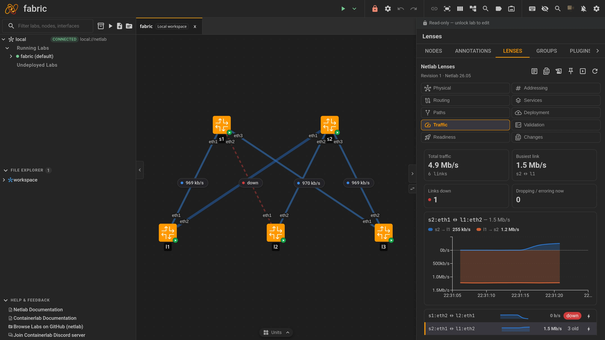
</a>
<p><b>Break things on purpose</b><br />Take a link down or add delay and loss from its menu — then watch the routing protocols react.</p>
</td>
</tr>
<tr>
<td width="50%" valign="top">
<a href="docs/images/validation-verdict.webp">
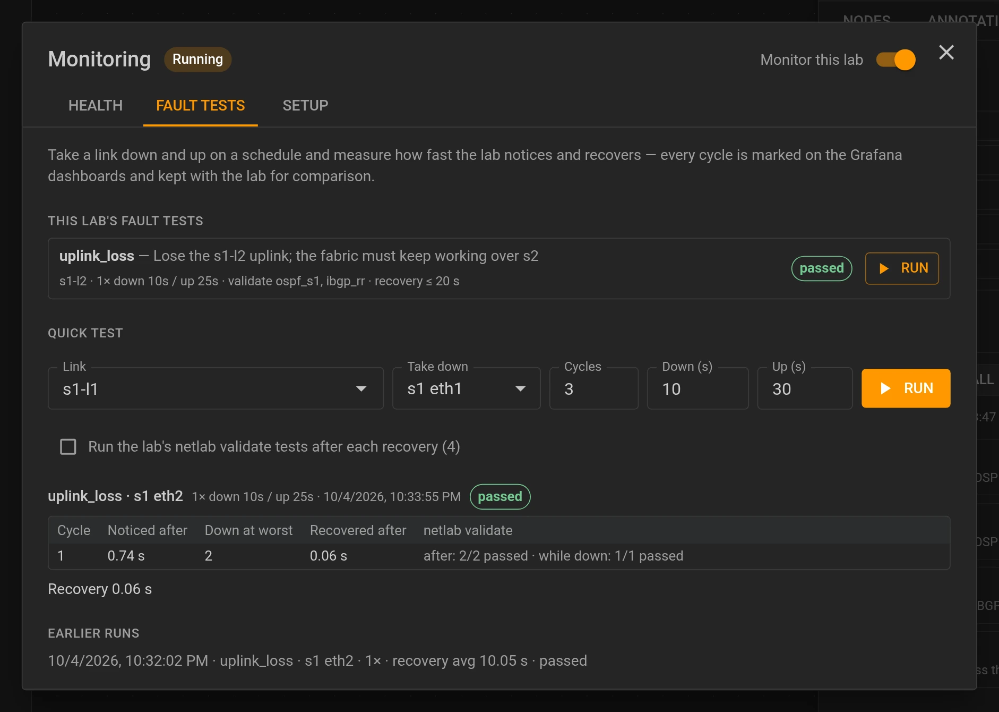
</a>
<p><b>Validate the lab, then break it</b><br />Run the lab's netlab validate tests, then a fault test: take a link down, check the fabric holds, and get a pass/fail verdict.</p>
</td>
<td width="50%" valign="top">
<a href="docs/images/monitoring-health.webp">
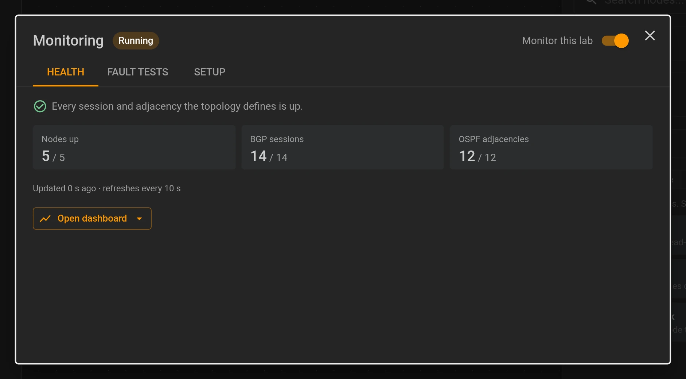
</a>
<p><b>Monitor any lab, with Grafana inside</b><br />Health against the topology, per-link and per-protocol metrics, and Grafana dashboards in a tab, for FRR or any other vendor.</p>
</td>
</tr>
<tr>
<td width="50%" valign="top">
<a href="docs/images/config-drift-diff.webp">
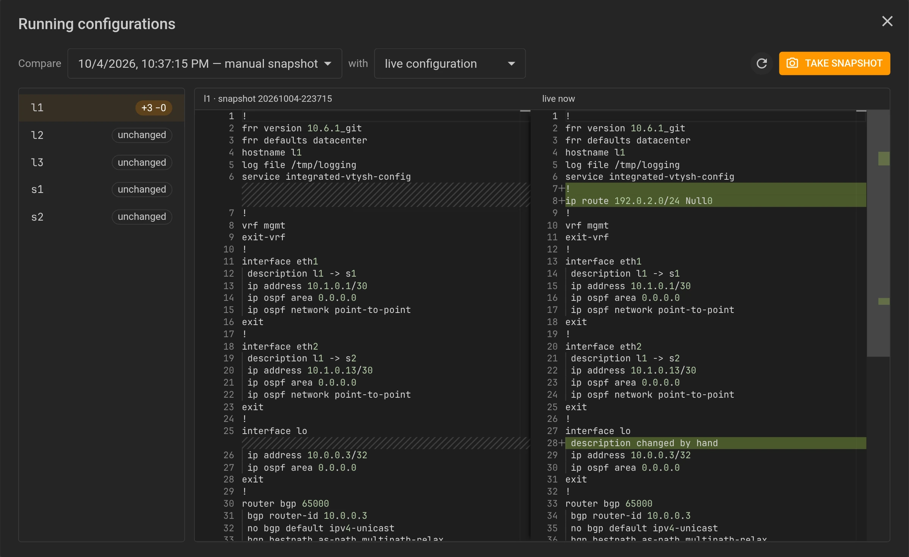
</a>
<p><b>See what changed on the devices</b><br />Snapshot every node's running config, change things by hand, and get a per-device diff of exactly what moved.</p>
</td>
<td width="50%" valign="top">
<a href="docs/images/reports-gallery.webp">
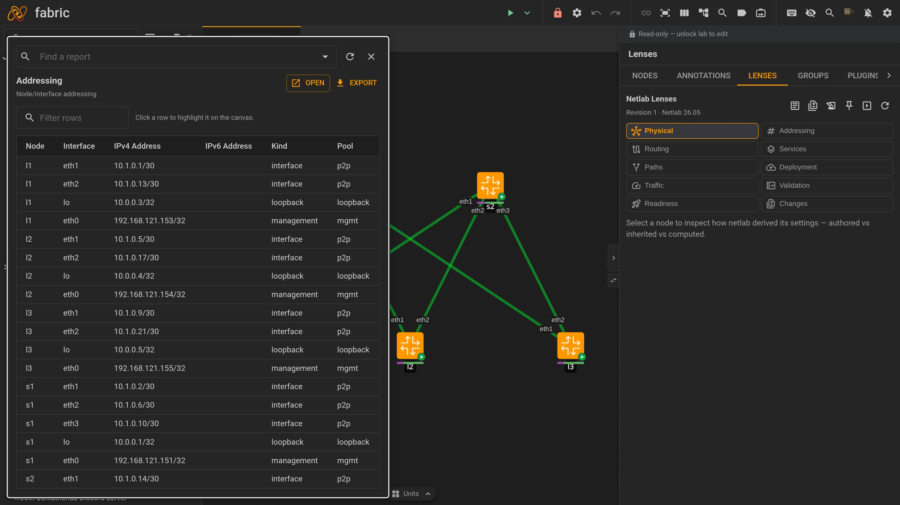
</a>
<p><b>netlab reports, interactive</b><br />Addressing, BGP, OSPF and wiring reports as searchable tables, rendered HTML or text — download any format.</p>
</td>
</tr>
<tr>
<td width="50%" valign="top">
<a href="docs/images/ai-agents-proposal.webp">
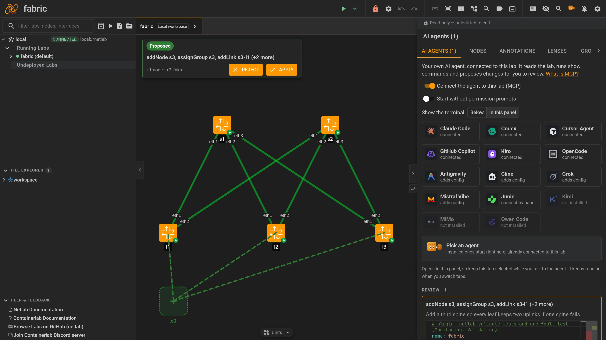
</a>
<p><b>Bring your own AI agent</b><br />Claude Code, Codex, Copilot, Kiro or any MCP tool, connected to the lab. It proposes changes; you review the diff.</p>
</td>
</tr>
</table>

<!-- showcase:end -->

## Quick start

The container is the UI; it uses the netlab and containerlab you have installed on the host:

```bash
NETLAB_BIN=$(command -v netlab) CLAB_DIR=$(dirname "$(command -v containerlab)") \
  docker compose up -d        # uses docker-compose.yml; labs live in ./labs
```

Open `http://localhost:8000`. The flags that matter, multi-user setups and building it yourself are in [docs/container.md](docs/container.md). To run from source instead, see [CONTRIBUTING.md](CONTRIBUTING.md).

## Documentation

| | |
| --- | --- |
| [Features](docs/features.md) | Shortcuts, run on nodes, search, running configs, exercises, live traffic, faults, packet capture, providers, reports |
| [Monitoring](monitoring/README.md) | The netlab `monitoring` plugin: metrics, routing-protocol state and Grafana dashboards for any lab and vendor — also usable without the UI |
| [AI agents](docs/ai-agents.md) | Start Claude Code, Codex, Copilot, Kiro and more connected to your lab, or connect any MCP tool; review what it proposes |
| [Running as a container](docs/container.md) | Images, required flags, several users on one server |
| [Desktop app](docs/desktop.md) | The Electron shell around the same UI |
| [Architecture](docs/architecture.md) | How netlab-ui builds on clab-ui and netlab |
| [netlab docs: netlab-ui](https://netlab.tools/extool/netlab-ui/) | netlab-ui as a netlab external tool (`tools: [netlab-ui]`); the page goes live once [ipspace/netlab#3913](https://github.com/ipspace/netlab/pull/3913) is merged |
| [Contributing](CONTRIBUTING.md) | Dev setup, checks, API types, clab-ui patches, showcase |

## Thanks

None of this exists without [ipspace/netlab](https://github.com/ipspace/netlab) and [srl-labs/containerlab-app](https://github.com/srl-labs/containerlab-app) (clab-ui) / [srl-labs/containerlab](https://github.com/srl-labs/containerlab) doing the actual hard work underneath. Big thanks to SRL Labs and Nokia for open-sourcing and maintaining tools this good ❤️
