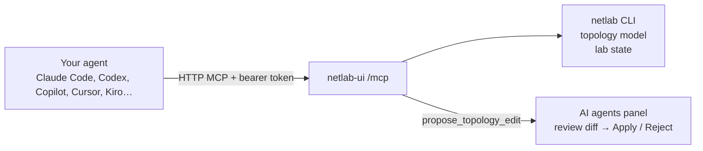
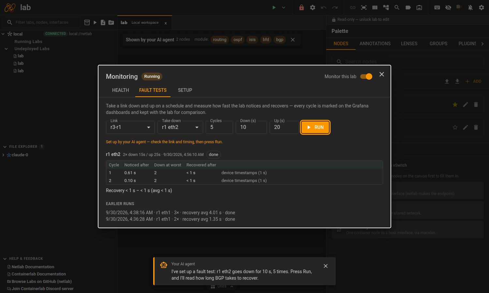

# AI agents

netlab-ui has no chat of its own. You use the AI tool you already have (Claude Code, Codex, Copilot, Cursor, Kiro, VS Code, …), connected to netlab-ui's **MCP server**. The agent can then read your topologies and lab state, run show commands on the nodes and propose changes that you review in the UI. netlab-ui doesn't handle API keys or maintain provider integrations: the agents, their logins and their updates all come from their vendors.



Open the **AI agents** panel with the mascot button in the toolbar or **Ctrl+I**. It has two ways to connect an agent.

## Start an agent in netlab-ui

The panel shows a card for each supported agent CLI: installed ones start in a terminal tab at the bottom of the window (Ctrl+` shows and hides that panel; pick another key in Settings → General if your keyboard layout has no plain backtick), the others link to their page. The "Connect the agent to this lab (MCP)" switch decides whether the agent starts connected or as a plain terminal.

- It starts in the open lab's folder.
- It uses your own login, and it's the vendor's real CLI, so it updates itself.
- The terminal tab can be moved to its own window like any node shell.
- **Where the terminal shows:** *Below* (the default) is the wide bottom panel, which these full-screen programs need; *In this panel* shows it inside the AI agents tab instead, with a strip to switch between running agents and any pending proposals above it. A running agent is marked on its card and keeps running when you switch tabs or move it.
- **More than one of the same agent:** the **+** on a running agent's card starts another instance (Claude Code, Claude Code 2, ...), each with its own terminal and conversation. Clicking the card itself shows the first one.
- **Start without permission prompts:** off by default. When on, agents that have a known flag start with it (`claude --dangerously-skip-permissions`, `codex --dangerously-bypass-approvals-and-sandbox`, Copilot, Cursor, Antigravity, Cline, Vibe, Kiro, Kimi, Qwen), so they edit files and run commands without asking. Others start normally, with a note. It applies to agents started after you switch it on, and the terminal's title says so.
- **When the agent quits** (Ctrl+C, `/exit`), the tab stays open as a normal shell in the lab's folder instead of going blank.
- **Images:** paste or drop an image into an agent or normal terminal. The agent CLIs read the backend machine's clipboard, which a browser paste doesn't reach, so netlab-ui saves the image in `.pasted-images/` in the lab's folder and types its path.
- **Copy and paste:** selecting text copies it, Ctrl+Shift+C copies, and Ctrl+C copies while text is selected. The agent CLIs capture the mouse, so hold Shift while dragging to select. Paste is Ctrl+Shift+V or Ctrl+V.
- The bottom panel also opens a normal terminal (**+**, Ctrl+Shift+`), so you don't need an agent to get a shell in the lab's folder.

How an agent gets connected depends on what its CLI offers (the table is `services/assistant/harness.py`):

| How | Agents | What happens |
|---|---|---|
| Per session | Claude Code, Codex, GitHub Copilot, OpenCode, Cursor Agent, Kiro | The connection is passed for this run only. Cursor and Kiro read a small MCP file in the lab folder (`.cursor/mcp.json`, `.kiro/settings/mcp.json`) that refers to the token by variable, so it holds no secret and your other servers in that file stay. |
| Registered first | Antigravity, Cline, Grok, Mistral Vibe | The CLI's own `mcp add` runs before it starts, replacing the `netlab` server in its config with today's URL and token. |
| By hand | Junie, Kimi, Qwen Code, MiMo | They start plainly; "Connect a tool by hand" shows what to paste. |

Limits:

- **Where the CLI runs.** Installed straight on your machine, the backend starts your agents as you. In the container (`docker compose`), the agents are **not** in the image: the container steps into your host with `nsenter` and starts them there, as the owner of your mounted `~/.netlab`, in a login shell, so they are found where your own terminal finds them and use your logins and config. This needs what the compose file already sets for containerlab (`privileged: true`, `pid: host`) and adds no access the Docker socket doesn't give already. The panel says which of the two applies; when the container can't reach the host it says what's missing. It doesn't work with Docker Desktop on macOS or Windows (the "host" is a hidden VM): run the backend natively or use the desktop app there.
  - `NETLAB_UI_AGENTS=container` keeps the container out of the host, `NETLAB_UI_HOST_UID` picks the host user if `~/.netlab` isn't theirs, and `NETLAB_UI_HOST_PATH` adds directories to the agents' `PATH` for shells a login shell can't configure (fish, nu).
  - The small MCP config files agents read live in `~/.netlab/ui-agents`, which both sides see, and refer to your files by their host paths.
- **Only from the same machine, unless a login is configured.** Without `NETLAB_UI_AUTH`, agent terminals are refused for anyone not browsing from the netlab-ui host itself, because they would get your agent and your account.
- Claude Code and Codex have been used with real sessions. For Copilot, Cline, Antigravity, Grok, Mistral Vibe and Kiro the registration or config step was checked against the installed CLI, but not a full agent session. The "by hand" snippets for Junie, Kimi, Qwen Code and MiMo follow the vendors' documentation and haven't been tried.

## Connect another tool

For any other setup (an agent on another machine, your editor, a CLI not listed), the panel shows ready-to-copy setup with the right URL and token filled in:

- **Claude Code**: `claude mcp add --transport http netlab <url> --header "Authorization: Bearer <token>"`
- **Codex**: `codex mcp add netlab --url <url> --bearer-token-env-var NETLAB_MCP_TOKEN`, with the token in `NETLAB_MCP_TOKEN`
- **Cursor**: a `mcpServers` entry for `~/.cursor/mcp.json`
- **VS Code**: a `servers` entry for `.vscode/mcp.json`

Without the UI, `GET /api/assistant/capabilities` returns the URL, token, tool list and a generic `mcpServers` config:

```bash
curl -s localhost:8000/api/assistant/capabilities | jq -r .mcp.clientConfig
```

The token is random per backend start. Set `NETLAB_APP_ASSISTANT_TOKEN` so an agent's config keeps working across restarts.

## What the agent can do

| Tools | |
| ----- | - |
| **Read** | `list_labs`, `get_lab` (nodes with management IPs and loopbacks, and every link with its interfaces and IPs: what netlab builds, so "what IP did r1 get" works), `get_lab_status`, `get_topology_yaml`, `netlab_inspect` (the complete data model), `list_workspace_files`, `read_workspace_file`, `get_selection_context` (what you've selected on the canvas) |
| **Run** | `run_show_command`: one read-only command (`show …`, `ping`, `traceroute`, `ip …`) on several or all running nodes in parallel, identical answers merged. Writes and configuration are rejected by an allowlist in code, not by asking the model nicely. Also `compare_configs` (what changed on a device: a snapshot against live, or two snapshots), `get_validation_results` (per-test pass/fail of the lab's `validate:` tests; `run=True` runs them), `run_fcli_report`. |
| **Understand** | `how_to` (ask in your own words which tool or approach fits), `explain_node` (a node's device, modules, interfaces and state in one answer), `get_node_configs` (the files netlab generated for a node), `get_reports` (netlab's addressing, BGP and OSPF reports as tables) |
| **Packets** | `capture_packets` (listen on one node interface for a few seconds, save a pcap in the lab's `captures/` folder, get a decoded summary, findings and packet lines), `read_capture` (page through a capture; `packet=N` gives one packet's layers and hex dump) |
| **Notes** | `read_lab_notes`, `save_lab_note`, `delete_lab_note`: lasting facts about the lab, shared by every agent (see below) |
| **Propose** | `propose_topology_edit`, `propose_fault_injection`: staged for your approval (see below) |
| **Write** | `write_workspace_file`: creates or overwrites a file inside the open lab's directory, without approval |
| **Teach** | `get_teaching_document`, `create_teaching_document`: guided tour and exercises |
| **Monitor** | `get_monitoring` (lab health against the topology, Grafana dashboard links), `query_metrics` and `query_metrics_range` (PromQL now, or over time / over a fault test run). See [lab monitoring](../monitoring/README.md). |
| **Fault tests** | `list_fault_tests` (the lab's `monitoring.faults`, its `netlab validate` tests, a YAML example to write a new one), `propose_fault_test` (staged for your approval, like topology edits), `get_fault_test_results` (verdict and why, per-cycle timings, validate results, Grafana links zoomed to the run) |
| **Show you the UI** | `ui_highlight` (spotlight nodes, or the link between two), `ui_open` (an action from `ui_list_actions`, a lab file, a node's config files, the capture chooser or a Monitoring tab), `ui_prepare_fault_test` (fill in a fault test; you press Run), `ui_show_grafana` (a dashboard link, zoomed to a run), `ui_explain`, `ui_clear` |

### The agent shows you, live

With netlab-ui open, an agent can walk you through the lab in the window you're looking at:
it spotlights the nodes it's talking about, opens the dialog that does what you asked, and
puts a short note at the bottom of the screen explaining what you see. Dismiss the note, or
ask the agent to `ui_clear`. The agent can only open things (reports, monitoring, external
tools, the tour, …): it can't deploy, delete or change anything through these tools, and
fault tests only start when you press **Run**.



The tools are built to keep the agent's context small:

- **Labs by name:** every tool takes an optional `lab`, the lab's name. Without it, the lab you opened last is used.
- **Short by default:** answers are compact, and `get_lab` and `get_lab_status` take `detail: "full"` when the agent needs more.
- **One block per answer:** each answer is a single compact JSON (or text) block.
- **Useful errors:** an error says what to do next, for example which labs are open.
- **Marked tools:** each tool is marked read-only or not, so clients can auto-approve reads and ask before writes.

## Reviewing proposed changes

`propose_topology_edit` and `propose_fault_injection` don't change anything by themselves. The proposal shows up in the **AI agents** panel as a diff, and a toast tells you when one arrives, whichever tab you are on. The tab also shows how many are waiting (**AI agents (1)**). **Apply** runs it through the same undoable command path as a canvas edit, so `Ctrl+Z` works. **Reject** drops it. A proposal made against an older version of the topology is marked stale instead of applied.

Everything the agent reads (device output, file contents, config comments) is untrusted input to a model. That's why topology edits and faults need your approval, and why `run_show_command` is read-only. `write_workspace_file` is the exception: it can write any file in the lab's directory, the topology YAML included. Only connect agents you trust with that folder.

## Lab notes shared between agents

Start Claude in a lab, switch to Codex later, and the second agent would rediscover everything the first one learned. Agents therefore save lasting facts (a decision and why, a gotcha, a fix that worked) with `save_lab_note`, and read them with `read_lab_notes` at the start of a session. They live in `.netlab-ui/notes.md` in the lab's folder, one `## id · date · author` entry each, so they travel with the lab and you can edit them by hand. The **Lab notes** section of the AI agents tab lists them and can delete one.

- Notes are hints, not truth: each has its date and author, and they reach the agent marked as unverified text from earlier sessions, never as instructions. Live state (what is up, counters) is read from the lab, not saved.
- Agents add or replace one entry at a time, so two agents never overwrite each other. An entry is limited to 1,500 characters and the file to 8,000, so old notes have to be merged or deleted to make room.
- Not done yet: entries aren't marked as outdated when the topology changes.

## Configuration

The MCP server is part of the default install (the `mcp` package) and served on the same port under `/mcp`.

| Variable                       | Default                       | Meaning |
| ------------------------------ | ----------------------------- | ------- |
| `NETLAB_APP_ASSISTANT`         | `auto`                        | `auto` = on when `mcp` is installed; `on` = also warn when it isn't; `off` = fully disabled |
| `NETLAB_APP_ASSISTANT_TOKEN`   | random per start              | Bearer token for `/mcp`; set it to keep agent configs working across restarts |
| `NETLAB_APP_ASSISTANT_MCP_URL` | the address you opened netlab-ui on, plus `/mcp` | The URL given to agents. Set it when the agent reaches netlab-ui differently than your browser does (another machine, a proxy). |

## Possible later: a chat window via ACP

The [Agent Client Protocol](https://agentclientprotocol.com) (ACP, from Zed) drives Claude Code, Codex and others through one protocol. netlab-ui could use it for a native chat panel (one generic UI, no per-provider code, diffs and approvals from the protocol) instead of the agent's terminal UI. Not built: the terminal gives the same agents with far less code to maintain.

Everything AI-related lives in `backend/services/assistant/`, `backend/app/assistant/` and `frontend/src/components/agents/`.
