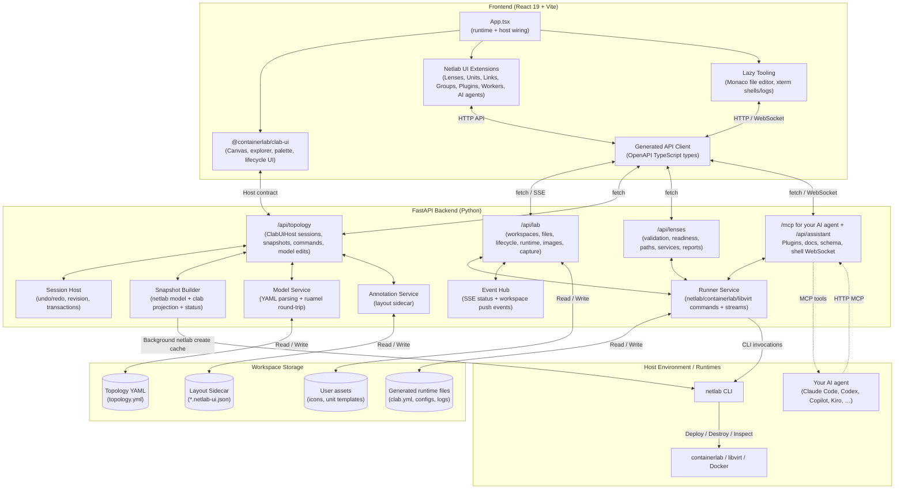
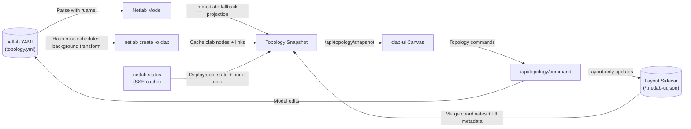

# Architecture

## Why this approach?

We consume `@containerlab/clab-ui` as a normal **npm dependency** (not a fork or local checkout) and feed it netlab data through a thin Python adapter.

- **No Rebasing Debt:** Because `clab-ui` moves fast and is published as a reusable library with an integrator contract, we get design updates via simple version bumps.
- **Single Source of Truth:** Netlab remains the ultimate source of truth. The netlab-to-clab projection (`netlab create -o clab`) is what gets rendered.

---

## Components

- **Backend (`backend/`)** — Built with FastAPI. It implements clab-ui's `ClabUiHost` contract (`/api/topology/{sessions,snapshot,command}`), wraps lab lifecycle/runtime/file APIs, and provides lenses, plugin, schema/docs, shell, capture, and the MCP server for AI agents.
- **Frontend (`frontend/`)** — React 19 + Vite. Consumes the clab-ui canvas and overlays netlab-native panels and tools for units, links, groups, plugins, workers, lenses, files, shells/logs, and the AI agents panel.

### Data & Projection Flow

To keep the primary netlab YAML file clean, coordinates and visual metadata are projected/merged on-the-fly and stored in a sidecar file.

## About `@containerlab/clab-ui`

[`@containerlab/clab-ui`](https://www.npmjs.com/package/@containerlab/clab-ui) is published on the public npm registry (source lives in the [containerlab-app](https://github.com/srl-labs/containerlab-app) monorepo), so a plain `npm install` is all it takes — no token or `.npmrc`. It requires **Node ≥ 24**.

The frontend imports `@containerlab/clab-ui` directly wherever it's needed (see `frontend/src/App.tsx`, `frontend/src/host/`, etc.) — there is no local checkout, stub, or swap-point to configure.

`@containerlab/clab-ui` is pinned to an exact version (`0.3.2`), with small
`patch-package` patches applied on install (`frontend/patches/`, applied in order):

| Patch | What it does |
| --- | --- |
| `001 initial` | Exports netlab-ui needs, plus two UI fixes (YAML tab race, panel flicker) |
| `002 lifecycle-context` | The host can set the progress modal's lab name and follow-up buttons |
| `003 editor-host-fields` | The node editor carries host-owned fields (netlab attributes) |
| `004 link-actions` | Link menu actions provided by the host |
| `005 runtime-link-status` | Running links turn green: runtime updates also set `linkStatus` |

They patch clab-ui's built files, so a clab-ui version bump means redoing them;
[CONTRIBUTING](../CONTRIBUTING.md#clab-ui-patches) has the workflow.
