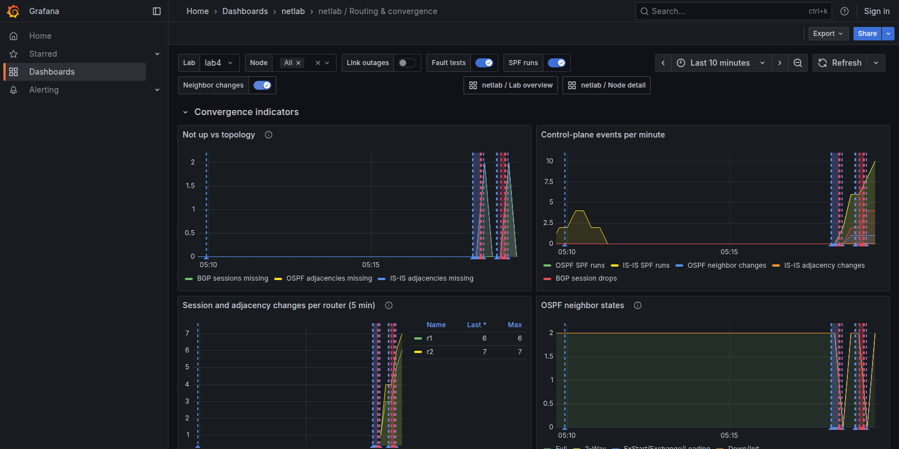

# netlab lab monitoring

A netlab **plugin** that adds monitoring to any lab, for every device type, with nothing
installed in the devices and no change to netlab itself:

* **Every container and libvirt VM**: CPU, memory and per-interface traffic, errors, drops,
  link state and link flaps -- read on the lab host (`/proc`, cgroups, libvirt state).
* **Routing protocol state**: OSPF, IS-IS, BGP, BFD and routing-table size, chosen per device:
  FRR-based devices through the FRR daemons' own sockets, gNMI devices (SR Linux, Arista,
  Juniper) through gnmic, SNMP devices through snmp_exporter.
* **What the topology intends**: every BGP session and OSPF/IS-IS adjacency netlab configured,
  so "defined but not up" works the same for every vendor.
* **Storage and dashboards**: VictoriaMetrics (Prometheus-compatible, light at scale) and
  Grafana with three dashboards: lab overview (a topology graph is folded at the bottom, for
  Grafana without netlab-ui), routing &
  convergence (flaps per router, OSPF neighbor states, BGP per peer, SPF, LSAs), node detail.

Every metric carries netlab names -- `node`, `ifname`, `link`, `peer_node` -- so a query or a
dashboard never needs to know which vendor or collection method produced it.


## Use it

### From the netlab CLI

```bash
ln -s /path/to/netlab-ui/monitoring/plugin/monitoring ~/.netlab/monitoring   # once
```

```yaml
# topology.yml
plugin: [ monitoring ]
```

`netlab up` writes `monitoring/` next to the topology, starts the stack after the lab and
prints the Grafana URL (`http://<host>:3000`, anonymous read-only; `admin`/`admin` to edit).
`netlab down` stops it; the metrics stay in `monitoring/data` for later comparison.

### From netlab-ui

Lab context menu or Ctrl+P → **Monitoring…** → switch it on. The UI installs the plugin in
`~/.netlab` and edits the topology for you. The dialog has three tabs:

* **Health**: nodes, BGP sessions and OSPF/IS-IS adjacencies up vs what the topology defines,
  what is missing, and buttons for the dashboards.
* **Fault tests**: repeatable link flaps (see below).
* **Setup**: where the stack runs, start/stop, and how each node is collected.

### Dashboard markers

Toggles at the top of every dashboard switch these markers on and off:

| Toggle | Default | Shows |
|---|---|---|
| **Link outages** | on | Orange band: a link taken down from netlab-ui, until it came back up |
| **Fault tests** | on | Purple band: each down period of a fault test |
| **SPF runs** | off | Blue line: when a router ran OSPF or IS-IS SPF |
| **Neighbor changes** | off | Red line: when an OSPF/IS-IS adjacency or BGP session last changed, per router and peer |

SPF and neighbor markers come from the devices' own timestamps, so they sit at the moment the
router did it, not at the next scrape. Turn them on next to a fault test to see which
routers recalculated, and how often, after a link went down and came back.



### Fault tests (repeatable link flaps)

A fault test takes links down and up on a fixed schedule and measures every cycle:

| | |
|---|---|
| Reaction | Time from link down until a session/adjacency the topology defines went down |
| Impact | How many were down at the worst moment (and which) |
| Recovery | Time from link up until everything the topology defines was up again, from the devices' own "last changed" timestamps where they report them, otherwise sampled twice a second |

Containers are flapped with `ip link`, libvirt VMs with `virsh domif-setlink`.

**Write them into the topology**, next to netlab's own [validation tests](https://netlab.tools/topology/validate/),
so they're versioned with the lab and give the same answer every run:

```yaml
monitoring.faults:
  core_link:
    description: Lose the r1-r2 link (OSPF, IS-IS, iBGP)
    links: [ r1-r2 ]          # link names, or ends like r1:eth1
    cycles: 3
    down: 10                  # seconds down, then up, per cycle
    up: 30
    during: [ ospf_r2 ]       # netlab validate tests while the link is down
    validate: [ ospf_r2, ibgp ]   # ... and after it comes back (true: all tests)
    expect.recovery: 5        # recovery slower than this fails the run

validate:                     # netlab's own tests, run by `netlab validate` too
  ospf_r2:
    description: r1 has a Full OSPF adjacency with r2
    wait: 20
    nodes: [ r1 ]
    plugin: ospf_neighbor(nodes.r2.ospf.router_id)
  ibgp:
    description: iBGP r1 - r2 established
    wait: 30
    nodes: [ r1 ]
    plugin: bgp_neighbor(node.bgp.neighbors,'r2')
```

The two sides complement each other: monitoring times what the control plane did,
`netlab validate` checks what the lab has to deliver (neighbors, prefixes, reachability) with
each device's own validation plugin. A run **passes** when every cycle recovered within
`expect.recovery` and every `validate` test passed afterwards; otherwise the verdict lists why.
Tests run while the link is down use `--skip-wait` (the state right then), tests after
recovery use their own `wait:`.

In netlab-ui the Fault tests tab lists the lab's fault tests with a **Run** button and their
last verdict; a quick test (any link, optionally with all `validate` tests) is there too.
Runs are saved in `monitoring/scenarios/*.json` next to the topology, and each cycle is a band
on the dashboards. API: `GET /api/lab/monitoring/faults`, `POST /api/lab/monitoring/scenarios`
(`{"sessionId": ..., "name": "core_link"}`).


In the lab this was developed on, `core_link` recovers in 10.1 s on every cycle: FRR's OSPF
hello interval (10 s) decides it, and `netlab validate` agrees (9.6-9.8 s).

## Settings

All optional -- in the topology (`monitoring:`), or for every lab in `~/.netlab.yml`
(`defaults.monitoring.*`). See [`defaults.yml`](plugin/monitoring/defaults.yml).

| Setting | Default | Meaning |
|---|---|---|
| `monitoring.placement` | `tool` | `tool`: started by `netlab up` next to the lab (host network). `node`: the collector, metrics store and Grafana are added to the lab as containerlab nodes (they get management IPs, follow the lab's lifecycle and appear on the canvas) |
| `monitoring.interval` | `15` | Scrape interval (seconds) |
| `monitoring.retention` | `7d` | How long metrics are kept |
| `monitoring.nodes` | all | Monitor only these nodes or groups |
| `monitoring.grafana.enabled` | `true` | `false` keeps just the metrics store (use your own Grafana, or only netlab-ui) |
| `monitoring.ports.*` | 3000, 8428, … | Host ports (netlab multilab adds the lab id) |
| node `monitoring.enabled: false` | | Skip a node |
| node `monitoring.method` | profile | Override how a node is collected (`frr`, `gnmi`, `snmp`, `host`) |
| node `monitoring.exporters` | | Extra Prometheus exporters on the node, e.g. `[ { port: 9100 } ]` |

## Adding a device type (no code)

How a device is collected is data -- `defaults.monitoring.profiles.<device>`:

```yaml
defaults.monitoring.profiles:
  mydevice:
    method: gnmi              # frr | gnmi | snmp | host
    config: monitoring        # optional: <plugin>/<device or os>.j2 enables gNMI/SNMP on the device
    gnmi: { port: 57400, username: admin, password: admin, tls: skip-verify, mapping: openconfig }
  frr-clone: { use: frr }     # inherit another profile
```

A device without a profile still gets host-side metrics (CPU, memory, interfaces). gNMI metrics
are mapped onto the `netlab_*` names by [`gnmi/netlab_map.star`](plugin/monitoring/gnmi/netlab_map.star)
(one table per protocol); SNMP counters by the relabel rules in `render.py`.

Bring your own tools: `monitoring/tsdb/scrape.yml` is a plain Prometheus scrape config and
the collector serves plain Prometheus text on `127.0.0.1:9480/metrics`, so any Prometheus,
Telegraf or Grafana can use them. Extra dashboards: drop Grafana JSON into
`monitoring/grafana/dashboards` (datasource uid `netlab`).

## Design

```
netlab create ──> plugin ──> monitoring/plan.json      (nodes, netlab names, expected sessions)
                          ├─> monitoring/collector/      (stdlib-only Python)
                          ├─> monitoring/tsdb/scrape.yml, gnmic/, grafana/, up.sh, stack.json
netlab up ──────> tool ────> collector (host /proc, docker API, FRR vty) ─┐
                          ├─> gnmic (gNMI devices only) ───────────────────┼─> VictoriaMetrics ─> Grafana / netlab-ui
                          └─> snmp_exporter (SNMP devices only) ───────────┘
```

* **No per-node processes, no `docker exec`, no management network needed** for containers:
  the collector reads `/proc/<pid>/net/dev`, the container's cgroup and its own sysfs, and
  talks to FRR's daemons over their unix sockets through `/proc/<pid>/root`. That also covers
  labs without a management network (for example beyond the Linux bridge's 1024-port limit).
* **Counters and timestamps, not just states**: SPF runs, neighbor state changes, BGP
  connections established/dropped, link carrier changes, and the time of the last change.
  Convergence and flaps are exact even with a 15-second scrape.
* The collector collects when it is scraped (fresh data within one interval) and costs
  roughly one core-percent per hundred nodes.

### Scale (measured in the development VM, 4 vCPU)

600 containers without a management network (500 Linux hosts + 100 FRR routers running
OSPF, IS-IS, BGP and BFD daemons), one collection cycle:

| Collector | Wall time | CPU time | Memory |
|---|---|---|---|
| Python, 1 thread | 0.48 s | 0.28 s | 26 MB |
| Python, 2 threads (default) | 0.56 s | 0.59 s | 26 MB |
| Go port of the same loop | 0.43 s | 0.33 s | 15 MB |

The cost is dominated by syscalls and FRR's own reply time, not the language, so the collector
stays in Python (stdlib only, runs on the stock `python:alpine` image). At 2000 nodes expect
about 1.6 s per cycle, well inside a 15-second interval.

## What is tested where

| | Status |
|---|---|
| FRR (OSPF, IS-IS, BGP, BFD, routes) via vty sockets | Tested against live FRR 10.4 routers, incl. a link flap |
| Host metrics, cgroup v1 | Tested live; cgroup v2 and libvirt with fixtures |
| `placement: tool` and `placement: node` | Tested live (containers started from netlab's `clab.yml`) |
| gnmic config + mapping (SR Linux native, OpenConfig) | gnmic loads the config; mapping tested with `gnmic processor` on sample events -- **needs a run against real SR Linux / cEOS** |
| SNMP (IOS, NX-OS) | Config rendering tested -- **needs a run against real devices** |
| libvirt VMs | Unit tests with libvirt state files -- **needs a run on a KVM host** |

## Tests

```bash
python -m pytest monitoring/tests      # needs netlab's Python (python-box, PyYAML)
```
